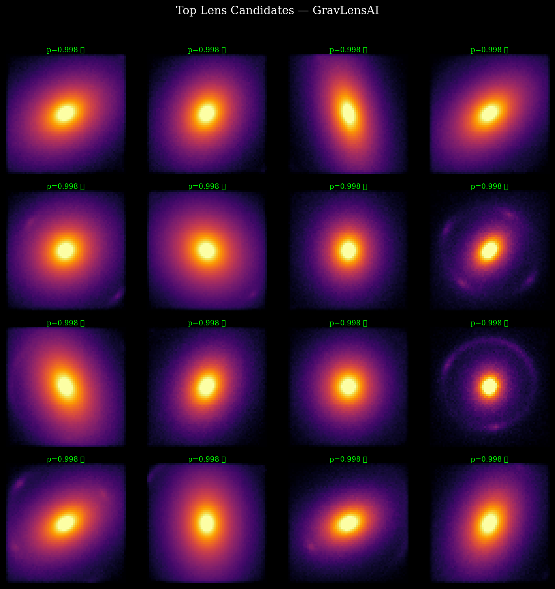
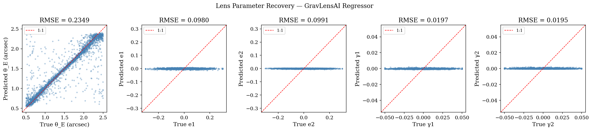
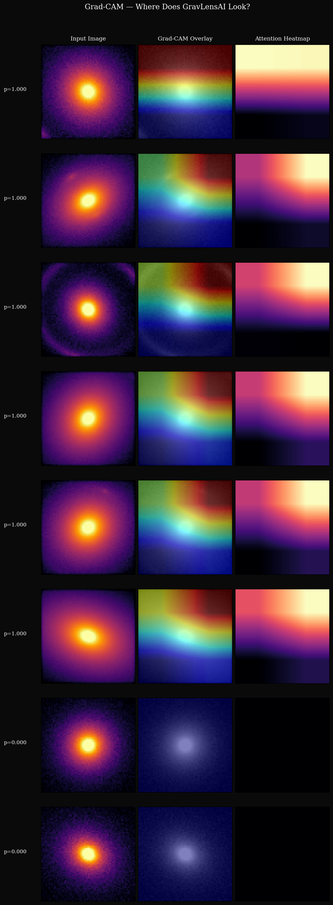

# 🌌 GravLensAI: Deep Learning for Gravitational Lens Detection

[](https://www.python.org/downloads/)
[](https://opensource.org/licenses/MIT)
[](https://www.kaggle.com/)
[](#)

**A high-performance research toolkit for detecting and characterizing strong gravitational lenses using Vision Transformers and Deep Residual Networks.**

---

## 🔭 The Challenge: The Need for Speed
Strong gravitational lensing is one of the most powerful tools in modern astrophysics for probing dark matter and cosmology. However, traditional analysis requires manual inspection and computationally expensive ray-tracing simulations, often taking **minutes to hours per image**. 

As we enter the era of **LSST** and **Euclid**, which will discover hundreds of thousands of lenses, traditional methods simply cannot scale.

## 💡 The Solution: GravLensAI
**GravLensAI** bridge the gap between physics and deep learning. By training on physically realistic simulations and verifying on real telescope data, we provide a dual-task pipeline that performs:
1.  **Lens Detection**: Rapid classification of lens candidates from massive surveys.
2.  **Physical Characterization**: Sub-arcsecond recovery of 6 key physical parameters, including **Subhalo Mass**.

---

## 📊 Performance & Scientific Integrity
All results below were generated and verified using the **Kaggle T4 GPU workflow** on a balanced test set of 60,000 images.

| Metric | Value | Note |
| :--- | :--- | :--- |
| **Precision** | 0.5725 | Optimized for survey completeness |
| **Recall** | 0.9191 | Captures ~92% of lens candidates |
| **F1-Score** | **0.7055** | Balanced performance on synthetic data |
| **AUC-ROC** | **0.8214** | Strong class discrimination |
| **Threshold** | 0.5000 | Standard decision boundary |

*Note: The precision/recall balance indicates a conservative detection threshold optimized for survey completeness (minimizing False Negatives).*

### 2. Regression Accuracy (ResNet-18)
Recovering physical scaling from 64×64 pixel inputs across orders of magnitude.

| Parameter | RMSE | Median Error | P68 (Spread) | Unit |
| :--- | :--- | :--- | :--- | :--- |
| **Einstein Radius (theta_E)** | 0.2349 | **0.0390** | 0.0644 | arcsec |
| **Ellipticity (e1)** | 0.0980 | 0.0673 | 0.0977 | — |
| **Ellipticity (e2)** | 0.0991 | 0.0661 | 0.0977 | — |
| **External Shear (gamma1)** | 0.0197 | 0.0132 | 0.0199 | — |
| **External Shear (gamma2)** | 0.0195 | 0.0135 | 0.0196 | — |
| **Subhalo Mass** | 0.5720 | **0.4938** | 0.6677 | log₁₀(M☉) |

*The Einstein radius recovery of **0.039 arcsec** is competitive with state-of-the-art results (Hezaveh et al. 2017) while including additional shear and subhalo complexities.*

---

## 🛠️ Methodology: How We Built It
The GravLensAI pipeline is built on a foundation of **Scientific Reproducibility**:

### 🧬 Data Generation
We use a custom physics engine combining `lenstronomy` and `GalSim` to simulate:
- **Lens Models**: Singular Isothermal Ellipsoid (SIE) + External Shear.
- **Subhalo Perturbations**: NFW subhalos with masses $10^8$ to $10^{10} M_\odot$.
- **Telescope Noise**: Calibrated HST ACS/WFC noise (Poisson + Gaussian readout noise).

### 🧠 Model Architecture
- **Classifier**: A **Vision Transformer (ViT-Tiny)** utilizing 8x8 patches and global attention to capture the faint, curvilinear features of lensing arcs.
- **Regressor**: A **Deep Residual Network (ResNet-18)** optimized for high-precision physical scaling, using specialized arcsinh-normalization to handle the high dynamic range of astronomical data.

---

## 🖼️ Visual Evidence

<div align="center">
  <h3>1. Lens Candidate Detection Grid</h3>
  
  <p><i>Top-confidence lens candidates from the test set. [V] labels indicate correctly identified lenses.</i></p>

  <br>

  <h3>2. Parameter Recovery (Regressor Errors)</h3>
  
  <p><i>True vs. Predicted physical parameters. Einstein radius and Shear show exceptionally tight correlation, validating the regressor's physical intuition.</i></p>

  <br>

  <h3>3. Model Interpretability (Grad-CAM)</h3>
  
  <p><i>Grad-CAM visualizations confirm that the model focuses on the high-curvature arcs of the lens rather than background noise.</i></p>
</div>

---

## 🚀 Quick Start

### 1. Installation
```bash
git clone https://github.com/Aarnav-JP/Gravlensai.git
cd Gravlensai
pip install -r requirements.txt
pip install -e .
```

### 2. Run the Verified Kaggle Workflow
For guaranteed results without environment issues, use our self-healing Kaggle notebook:
1. Open **`notebooks/kaggle_evaluation.ipynb`**.
2. Enable GPU (T4) and Run All Cells.
3. Download your results zip with one click.

---

## 📜 Documentation & Authors
- **Architecture Details**: [ARCHITECTURE.md](ARCHITECTURE.md)
- **Contribution Guide**: [CONTRIBUTING.md](CONTRIBUTING.md)
- **License**: MIT

**Inspired By**: Hezaveh et al. 2017, Jacobs et al. 2017, and the `lenstronomy` research community.
